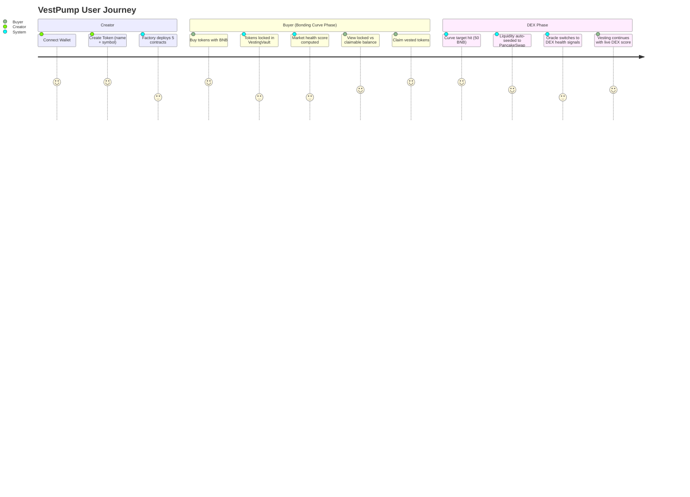
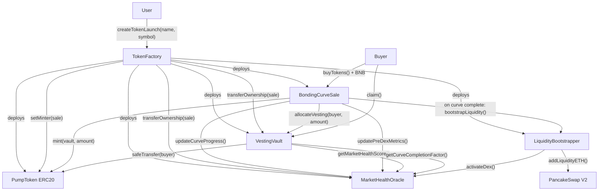

# VestPump 🚀

> **"The pump.fun experience, rebuilt for tokens that want to exist tomorrow."**

**VestPump** is a market-driven token vesting launchpad on BNB Chain. Token supply unlocks are *earned by market health* — not arbitrary time-based cliffs. It's pump.fun with guardrails: same bonding curve energy, but without the rug.

> **Hackathon:** BNB Chain Hackathon · **Network:** BSC Testnet  
> **Stack:** Scaffold-ETH 2 · Solidity · Next.js · wagmi · Hardhat

---

## The Problem → Solution

| pump.fun Pain | VestPump Solution |
|---|---|
| Instant dumps kill momentum | Vesting preserves narrative — no one can nuke the chart |
| Creators abandon tokens at DEX | Creator allocation is also vested |
| No long-term trust | Market-aligned unlocks build credibility |
| One-shot hype with no second day | Sustained curve-driven growth |

**👉 "You still pump. You just don't nuke your own chart."**

---

## Value Proposition

Vesting in crypto has always been time-based — arbitrary lockup schedules disconnected from reality. VestPump replaces this broken model with a live economic signal:

```
Unlocked = Allocation × MarketHealthScore × CurveCompletionFactor
```

- **MarketHealthScore** (0–100%): Computed from buyer count, buy velocity, liquidity depth, and price stability
- **CurveCompletionFactor** (0–100%): Rises as the bonding curve fills — a natural brake on early selling
- **No time cliff**: The market decides when tokens flow freely

---

## Target Users

| User | What they want | What VestPump gives them |
|---|---|---|
| 🎨 **Meme token creators** | Fair launch, no early dump | Locked supply enforced on-chain |
| 💰 **Speculative buyers** | Transparent rules, early curve entry | Predictable unlock visibility |
| 🏗️ **Serious builders** | Credible tokenomics | Market-aligned vesting with DEX auto-seeding |
| 🔁 **pump.fun veterans** | Same UX, better outcomes | Same bonding curve feel + vesting layer |

---

## User Journey


---

## System Architecture


---

## Quick Start

```bash
git clone <your-repo-url>
cd vestpump/src
yarn install
yarn start          # → http://localhost:3000
```

Requires: Node.js ≥ 20.18, Yarn, MetaMask set to BSC Testnet (Chain ID 97).  
BSC Testnet BNB: [hackathon-faucet.vercel.app](https://hackathon-faucet.vercel.app/)

See **[docs/TECHNICAL.md](docs/TECHNICAL.md)** for full setup, contract deployment, and step-by-step demo guide.

---

## Deployed Contracts (BSC Testnet)

| Contract | Address |
|---|---|
| **TokenFactory** | [`0x3C3d0E397065839e9d01a90bE04d01632062356C`](https://testnet.bscscan.com/address/0x3C3d0E397065839e9d01a90bE04d01632062356C) |

See **[bsc.address](bsc.address)** for full deployment info.

---

## Documentation

| File | Contents |
|---|---|
| [docs/PROJECT.md](docs/PROJECT.md) | Problem, solution, business model, GTM strategy, roadmap |
| [docs/TECHNICAL.md](docs/TECHNICAL.md) | Architecture, contracts, setup, demo walkthrough |
| [docs/EXTRAS.md](docs/EXTRAS.md) | Demo video & presentation links |

---

## License

MIT
