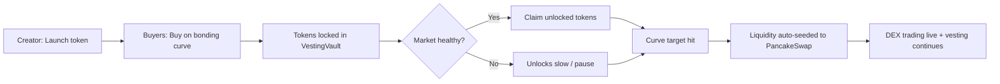

# Project: Problem, Solution & Impact

---

## 1. Problem

Token launch platforms today optimize for **price discovery alone**, ignoring circulating supply health. The result is a well-known failure pattern:

- **Early dumping**: Buyers accumulate on the bonding curve, then sell immediately when the token hits a DEX, crashing price and killing community momentum.
- **Time-based vesting is broken**: Traditional lockup schedules are arbitrary — they unlock tokens whether the market is healthy or collapsing, creating predictable but harmful cliff events.
- **Misaligned incentives**: Creators and early buyers both have incentives to exit rather than grow the market. Long-term holders are left holding the bag.

**Who is affected:** Meme token creators who lose their audience on day 2; retail buyers who get dumped on; the BNB Chain ecosystem which suffers from short-lived, low-trust token launches.

---

## 2. Solution

**VestPump** is a pump-style token launchpad where **token unlocks are earned by market health, not clocks**.

### Key Features

- **Bonding curve fair launch** — Linear price discovery from initial price to 10× at target. Fully transparent, no pre-sale allocation.
- **Instant vesting from block one** — Vesting begins the moment a user buys, even during the bonding curve phase.
- **No early transfers** — All tokens are held in `VestingVault` and cannot be transferred until the unlock formula allows it.
- **Market-driven unlock rate** — The `MarketHealthOracle` computes a live score from on-chain signals (buyer count, velocity, liquidity depth, price stability) that gates how fast supply unlocks.
- **Automatic DEX liquidity seeding** — When the bonding curve target is met, collected BNB is automatically deposited into PancakeSwap.
- **Sell during curve** — Users can sell tokens back during the bonding curve phase; tokens are burned and BNB is returned at the current spot price.

### Unlock Formula

```
Unlocked = Allocation × MarketHealthScore × CurveCompletionFactor
```

- `MarketHealthScore` — 0–100%, computed live from on-chain signals
- `CurveCompletionFactor` — 0–100%, rises as the bonding curve fills; acts as a natural brake on early unlocks
- No time component — the market decides when tokens flow freely

### User Journey



---

## 3. Business & Ecosystem Impact

### Target Users

| User | Motivation |
|---|---|
| 🎨 Meme token creators | Want fair launches that don't die on day 2 |
| 💰 Speculative early buyers | Want transparent unlock rules before committing |
| 🔁 pump.fun veterans | Same UX, better outcomes — without nuking their own chart |
| 🏗 Serious builders | Need credible tokenomics to attract a long-term community |

### Positioning

> **"The pump.fun experience, rebuilt for tokens that want to exist tomorrow."**

VestPump is not anti-pump.fun. It is **pump.fun + guardrails**: same bonding curve energy, but with a vesting layer that aligns creators, buyers, and liquidity from day one.

### GTM Strategy (pump.fun User Conversion)

**Primary channel — Crypto Twitter narrative campaigns**
- Content: *"Why 99% of pump.fun charts die on day 2"*, *"What if early buyers couldn't insta-dump?"*
- CTA: *"Launch your next token with vesting ON by default."*
- This channel reaches the primary persona where they already live and engage.

**Meme-to-builder funnel**
- Lead with familiar language: "anti-rug pump", "fair pump", "longer pump"
- Introduce vesting mechanics as users explore — no tokenomics wizard fatigue
- Simple presets at launch: 🚀 Fast · ⚖️ Balanced · 🧱 Strong Hands

**Micro-influencer seeding**
- Target small-to-mid Twitter accounts with repeat coin launchers
- Offer: free featured launches, "Vested Creator" badge, analytics dashboards
- Avoid large macro influencers inconsistent with a niche DeFi audience

**Creator reputation layer** (planned)
- Creator score based on past launches, vesting adherence, post-launch activity
- pump.fun has zero identity continuity — this is a key differentiator

**Expansion flywheel**
```
Meme tokens launch with vesting → Charts last longer
→ Crypto Twitter notices healthier pumps → Creators migrate
→ Traders follow better liquidity → VestPump becomes default for "serious pumps"
```

### Ecosystem Value

- Reduces launch-and-dump cycles that harm the BNB Chain token ecosystem's reputation
- Creates on-chain evidence of healthy token economies (oracle data is fully public)
- Composable: oracle health scores can be consumed by other protocols (lending, insurance)

### Monetization (Post-Hackathon)

| Source | Model |
|---|---|
| Launch fee | Fixed BNB fee per `createTokenLaunch()` call |
| Protocol liquidity cut | Small % of DEX liquidity seeded goes to treasury |
| Premium analytics | Optional creator dashboard (health score history, unlock projections) |
| Featured listings | Curated promotion for paying projects |

---

## 4. Limitations & Future Work

### Current Limitations

| Limitation | Detail |
|---|---|
| Simplified oracle | Pre-DEX health score uses on-chain proxies (buyer count, velocity); not a real-time price feed |
| Spot price curve | Uses spot price approximation rather than true bonding curve integral; small rounding is possible |
| No MEV protection | Vulnerable to front-running; production requires commit-reveal or similar |
| No audit | Contracts are not audited; mainnet deployment requires a full security review |
| Single chain | BSC Testnet only; no cross-chain support in MVP |
| Access control | Ownership pattern used for MVP; production requires granular role-based access |

### Roadmap

**Phase 1 — Post-Hackathon**
- Chainlink TWAP oracle integration for accurate post-DEX health scoring
- Role-based access control (replace `Ownable`)
- Smart contract audit

**Phase 2 — Growth**
- Mainnet BSC deployment
- Creator reputation score and "Vested Creator" badge
- `$VEST` governance token for protocol parameter governance
- Token health leaderboard and discovery feed

**Phase 3 — Expansion**
- opBNB integration
- Advanced oracle plugins (custom health score strategies)
- Cross-chain bridge support
- Premium analytics dashboard for creators
