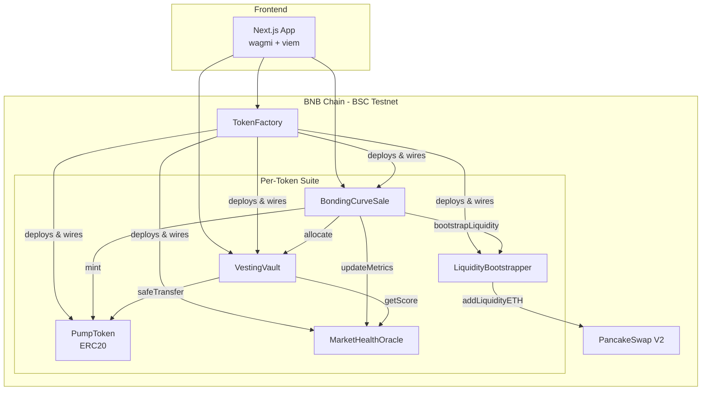
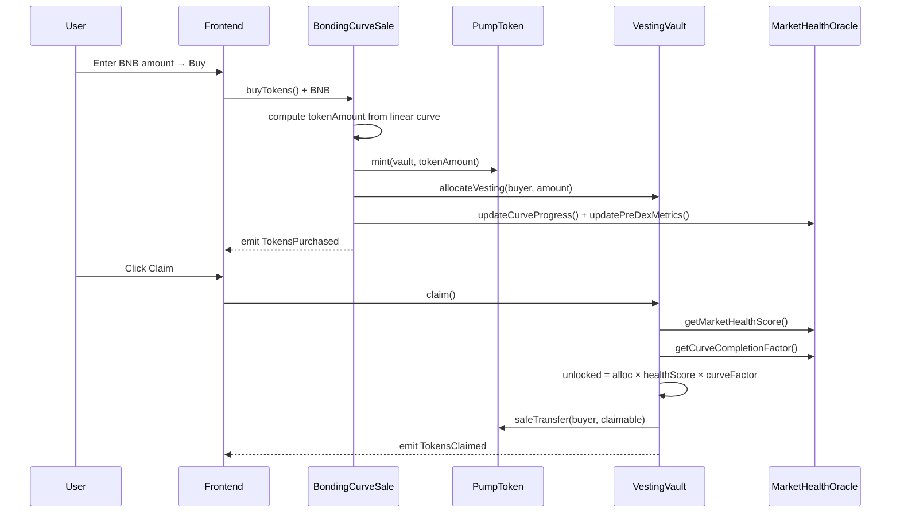
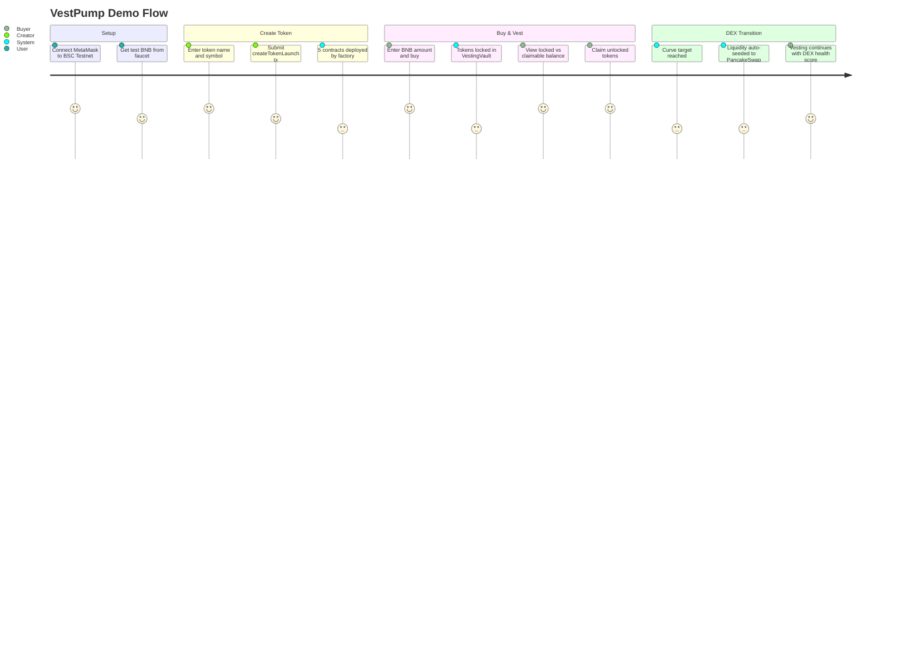

# Technical: Architecture, Setup & Demo

---

## 1. Architecture

### System Overview

VestPump uses a **factory pattern on BNB Chain**. One `TokenFactory` deployment creates a complete, wired suite of 5 smart contracts per token launch. The frontend (Next.js via Scaffold-ETH 2) interacts with these contracts using wagmi + viem. There is no backend — all logic is fully on-chain.

### Components

| Component | Technology | Role |
|---|---|---|
| **Frontend** | Next.js, wagmi, viem | Token creation, buy/sell UI, vesting dashboard |
| **TokenFactory** | Solidity | Deploys all 5 contracts per launch in one tx |
| **PumpToken** | Solidity (ERC20) | Token with controlled mint/burn |
| **BondingCurveSale** | Solidity | Handles buy/sell, tracks curve progress |
| **VestingVault** | Solidity | Locks tokens, computes & enforces unlocks |
| **MarketHealthOracle** | Solidity | Computes health score from on-chain signals |
| **LiquidityBootstrapper** | Solidity | Seeds PancakeSwap V2 on curve completion |

### Component Diagram



### Data Flow



### On-chain vs Off-chain

| Concern | Where |
|---|---|
| Token minting, transfer, burn | On-chain (PumpToken) |
| Vesting lock and unlock logic | On-chain (VestingVault) |
| Health score computation | On-chain (MarketHealthOracle) |
| DEX liquidity seeding | On-chain (LiquidityBootstrapper → PancakeSwap) |
| UI rendering and wallet connection | Off-chain (Next.js frontend) |

### Security Notes

- Only `BondingCurveSale` (set as `minter`) can mint or burn `PumpToken`
- `VestingVault` ownership transferred to `BondingCurveSale` — only the sale contract can allocate vesting
- `LiquidityBootstrapper` can only add liquidity once (`liquidityAdded` flag)
- Sell function uses checks-effects-interactions pattern to prevent reentrancy

---

## 2. Setup & Run

### Prerequisites

| Tool | Requirement |
|---|---|
| Node.js | ≥ 20.18.3 |
| Yarn | v1 or v2+ |
| MetaMask | Configured for BSC Testnet (Chain ID: 97) |
| BSC Testnet BNB | [hackathon-faucet.vercel.app](https://hackathon-faucet.vercel.app/) |

### Environment

No additional environment variables are required to run against the existing BSC Testnet deployment. The `TokenFactory` address is already configured in the frontend.

To deploy contracts yourself, copy and fill `.env.example`:

```bash
cp src/packages/hardhat/.env.example src/packages/hardhat/.env
# Set DEPLOYER_PRIVATE_KEY=0x...
```

### Install & Build

```bash
git clone <your-repo-url>
cd vestpump/src
yarn install
```

### Run

```bash
# Start the frontend (connects to BSC Testnet by default)
yarn start
```

Visit: **http://localhost:3000**

To deploy contracts to BSC Testnet yourself (optional — already deployed):

```bash
yarn deploy --network bscTestnet
```

### Verify

- Open http://localhost:3000 — the app should load and display the "Create Token" page
- Connect MetaMask (BSC Testnet, Chain ID 97)
- Confirm the `TokenFactory` address shown in the UI matches `0x3C3d0E397065839e9d01a90bE04d01632062356C`

Run smart contract tests:

```bash
yarn hardhat:test
```

---

## 3. Demo Guide

### Access

- **Live frontend:** http://localhost:3000 (after `yarn start`)
- **TokenFactory on BscScan:** [testnet.bscscan.com](https://testnet.bscscan.com/address/0x3C3d0E397065839e9d01a90bE04d01632062356C)

### Demo User Journey



### Key Actions (Step-by-Step)

1. **Connect wallet** — Open the app, connect MetaMask on BSC Testnet (Chain ID 97)
2. **Create a token** — Navigate to **Create**, enter a name + symbol (e.g. "Demo Token" / "DEMO"), click **Launch Token**
3. **Buy tokens** — On the token's Launchpad page, enter a BNB amount and click **Buy** — tokens are minted directly to `VestingVault`
4. **View your balances** — UI shows **Locked** and **Claimable Now** — observe that Claimable is a fraction of total (health score × curve factor)
5. **Claim** — Click **Claim** to withdraw currently unlocked tokens to your wallet
6. **Sell (optional)** — Switch to the **Sell** tab, approve once, then sell back to the curve — tokens are burned and BNB returned at spot price

### Expected Outcomes

| Action | What you see |
|---|---|
| Launch token | 5 contracts deployed; addresses appear in UI below the form |
| Buy | Locked balance increases; Claimable Now is a portion of locked (not 100%) |
| Claim | Wallet token balance increases; Claimable drops to 0 |
| Sell | Wallet BNB balance increases; token supply decreases |

### Troubleshooting

| Issue | Fix |
|---|---|
| MetaMask shows wrong network | Switch to BSC Testnet (Chain ID 97, RPC: `https://data-seed-prebsc-1-s1.binance.org:8545/`) |
| No test BNB | Get from [hackathon-faucet.vercel.app](https://hackathon-faucet.vercel.app/) |
| "Sell" reverts | Click **Approve** first on the Sell tab before selling |
| Claimable is 0 | Expected early on — health score × curve factor is low; buy more or wait for more buyers |
